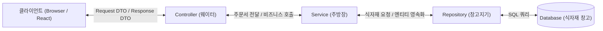
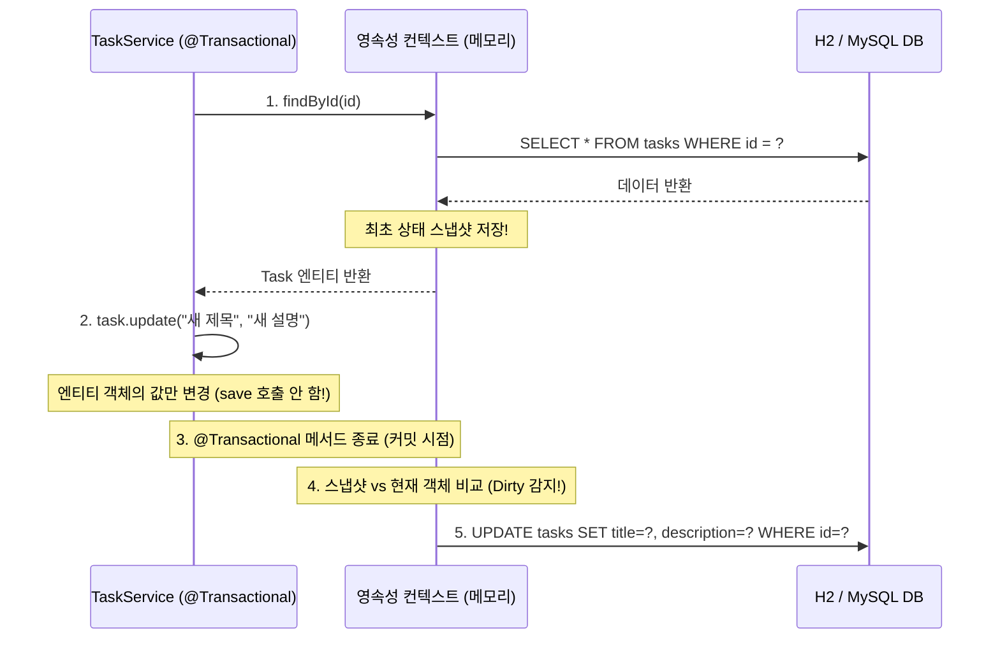

# Chapter 01. Spring Boot 엔터프라이즈 계층형 아키텍처와 JPA 심화

---

## 1. Chapter 제목 및 학습 목표

### [학습 목표]
* **계층형 아키텍처(Layered Architecture)의 본질 체화**: Controller, Service, Repository, Entity, DTO 간의 경계를 명확히 분리하고 단방향 의존성을 확립한다.
* **도메인 엔티티(Entity) 캡슐화**: 무분별한 @Setter를 배제하고, 객체 스스로가 비즈니스 규칙을 방어하는 도메인 주도 설계(DDD) 기초를 구현한다.
* **JPA 영속성 컨텍스트와 더티 체킹(Dirty Checking)**: 데이터 수정 시 .save()를 남발하지 않고, @Transactional 범위 내에서 변경 감지 메커니즘을 활용한다.
* **1:N 연관관계와 지연 로딩(LAZY)**: @ManyToOne(fetch = FetchType.LAZY)의 필요성을 이해하고 실무 성능 폭탄인 **N+1 문제**를 **Fetch Join**으로 격퇴한다.
* **방어적 프로그래밍과 예외 표준화**: @Valid 기반 유효성 검증과 @RestControllerAdvice 기반 글로벌 예외 처리를 통해 HTTP 상태 코드(200, 201, 204, 400, 404, 500)를 엄격히 통제한다.

---

## 2. 왜 이 기술/구조를 사용하는가? (Background & Architecture)

### 2.1 튜토리얼 숏컷(Toy Code)의 치명적 한계
많은 입문 강의와 튜토리얼은 빠른 완성을 위해 다음과 같은 **실무 금기 패턴(Anti-patterns)**을 사용한다:
1. **계층 파괴**: Controller가 Repository를 직접 주입받아 DB 쿼리를 수행 (비즈니스 검증 누락).
2. **엔티티 노출**: @RequestBody와 @ResponseBody에 DB 엔티티를 직접 바인딩 (Mass Assignment 보안 취약점).
3. **무검증 .get() 호출**: Optional.get()을 무조건 호출하여 데이터 부재 시 백엔드 스택 트레이스를 500 에러로 클라이언트에 노출.
4. **무분별한 .save() 호출**: 이미 영속화된 객체를 수정하면서 save()를 재호출하여 불필요한 쿼리 낭비.

### 2.2 엔터프라이즈 계층형 아키텍처 도입 이유
엔터프라이즈 대규모 웹 서비스는 수십 명의 개발자가 수년간 코드를 수정하고 확장한다.
* **책임의 분리 (SoC)**: 식당에서 손님을 응대하는 웨이터(Controller), 요리를 총괄하는 주방장(Service), 식자재 창고를 관리하는 창고지기(Repository)의 역할이 명확해야 시스템이 붕괴하지 않는다.
* **결합도 완화 (Decoupling)**: 프론트엔드의 화면 요구사항이 바뀌어도 DB 스키마(Entity)가 흔들리지 않아야 하며, 반대로 DB 구조가 변경되어도 클라이언트와의 API 계약(DTO)이 깨지지 않아야 한다.

---

## 3. 핵심 개념 해설 (Deep Dive)

### 3.1 식당 분업 시스템으로 이해하는 계층형 아키텍처



* **Controller (웨이터)**: 손님의 HTTP 요청 수신, 입력값 유효성 검사(@Valid), 비즈니스 계층 호출, 적절한 HTTP 상태 코드(201, 200, 204)와 DTO 반환.
* **Service (주방장)**: 핵심 비즈니스 로직 수행, 트랜잭션 경계 제어(@Transactional), 엔티티 상태 전이 및 도메인 규칙 검증.
* **Repository (창고 관리자)**: Spring Data JPA를 통한 데이터베이스 CRUD 인터페이스 추상화.
* **Entity (원물 식자재)**: 데이터베이스 테이블과 1:1 매핑되는 영속성 객체. 외부에 날것 그대로 노출 금지.
* **DTO (Data Transfer Object / 서빙 접시)**: 계층 간, 네트워크 간 데이터를 주고받기 위해 정제된 순수 데이터 객체.

---

### 3.2 JPA 영속성 컨텍스트와 더티 체킹 (Dirty Checking)

더티 체킹은 **트랜잭션 커밋 시점에 영속성 컨텍스트 내의 스냅샷과 엔티티의 현재 상태를 비교하여 변경사항을 자동 감지하고 UPDATE SQL을 생성하는 기술**이다.



---

### 3.3 지연 로딩(LAZY)과 악명 높은 N+1 문제 & Fetch Join

#### (1) 즉시 로딩(EAGER) vs 지연 로딩(LAZY)
* **EAGER (즉시 로딩 - 안티패턴)**: 댓글 1개를 조회할 때 연관된 태스크, 프로젝트, 사용자까지 무차별적으로 JOIN하여 DB 부하 급증.
* **LAZY (지연 로딩 - 실무 표준)**: 연관 객체는 가짜 대리 객체(Proxy)로 두고, 실제 해당 필드를 참조(`comment.getTask().getTitle()`)할 때 쿼리를 실행.

#### (2) N+1 문제의 발생과 Fetch Join 해결 원리
댓글 N개를 조회한 뒤 각 댓글의 태스크 제목을 출력할 때:
* `SELECT * FROM comments` (쿼리 1회)
* 각 댓글마다 태스크를 가져오기 위해 `SELECT * FROM tasks WHERE id = ?` (추가 쿼리 N회)
* **결과: 1 + N회의 쿼리 폭격 발생!**

```sql
-- 해결책: JPQL Fetch Join
-- 단 1방의 쿼리로 Comment와 Task를 INNER JOIN하여 영속성 컨텍스트에 완제품으로 로딩함
SELECT c FROM Comment c JOIN FETCH c.task
```

---

## 4. 단계별 구현 가이드 (Step-by-Step Implementation)

### 4.1 기본 감사 인프라: `BaseTimeEntity.java`
모든 엔티티에 생성일시(`createdAt`)와 수정일시(`updatedAt`)를 자동으로 주입하는 추상 클래스.

```java
package com.enterprise.taskmanager.global.common;

import jakarta.persistence.Column;
import jakarta.persistence.EntityListeners;
import jakarta.persistence.MappedSuperclass;
import lombok.Getter;
import org.springframework.data.annotation.CreatedDate;
import org.springframework.data.annotation.LastModifiedDate;
import org.springframework.data.jpa.domain.support.AuditingEntityListener;

import java.time.LocalDateTime;

@Getter
@MappedSuperclass // [1] 자식 엔티티에게 공통 매핑 정보를 상속
@EntityListeners(AuditingEntityListener.class) // [2] 엔티티 생명주기 이벤트 감시관 연결
public abstract class BaseTimeEntity {

    @CreatedDate
    @Column(updatable = false, nullable = false) // [3] 생성일시는 최초 저장 후 UPDATE 불가
    private LocalDateTime createdAt;

    @LastModifiedDate
    @Column(nullable = false) // [4] 수정 시점마다 현재 일시로 자동 갱신
    private LocalDateTime updatedAt;
}
```

---

### 4.2 도메인 엔티티: `Task.java`
`@Setter`를 완전히 제거하고 생성자 및 비즈니스 메서드로 상태 전이를 캡슐화한 엔티티.

```java
package com.enterprise.taskmanager.domain.task.entity;

import com.enterprise.taskmanager.global.common.BaseTimeEntity;
import jakarta.persistence.*;
import lombok.AccessLevel;
import lombok.Getter;
import lombok.NoArgsConstructor;

@Entity
@Table(name = "tasks") // [1] DB 예약어(TASK, USER 등) 충돌 방지를 위한 복수형 테이블명
@Getter
@NoArgsConstructor(access = AccessLevel.PROTECTED) // [2] 외부 new Task() 빈 생성 차단 & JPA 프록시 허용
public class Task extends BaseTimeEntity {

    @Id
    @GeneratedValue(strategy = GenerationType.IDENTITY) // [3] MySQL/H2 표준 AUTO_INCREMENT
    private Long id;

    @Column(nullable = false, length = 100)
    private String title;

    @Column(length = 1000)
    private String description;

    @Enumerated(EnumType.STRING) // [4] 절대 ORDINAL 사용 금지 (순서 변경 시 대참사 방지)
    @Column(nullable = false)
    private TaskStatus status;

    public Task(String title, String description) {
        this.title = title;
        this.description = description;
        this.status = TaskStatus.TODO; // [5] 최초 생성 시 TODO 상태 강제
    }

    // 비즈니스 방어 메서드
    public void update(String title, String description) {
        if (this.status == TaskStatus.DONE) {
            throw new IllegalStateException("이미 완료된 태스크는 수정할 수 없습니다.");
        }
        this.title = title;
        this.description = description;
    }

    public void changeStatus(TaskStatus newStatus) {
        this.status = newStatus;
    }
}
```

---

### 4.3 1:N 연관관계 매핑: `Comment.java`

```java
package com.enterprise.taskmanager.domain.comment.entity;

import com.enterprise.taskmanager.domain.task.entity.Task;
import com.enterprise.taskmanager.global.common.BaseTimeEntity;
import jakarta.persistence.*;
import lombok.AccessLevel;
import lombok.Getter;
import lombok.NoArgsConstructor;

@Entity
@Table(name = "comments")
@Getter
@NoArgsConstructor(access = AccessLevel.PROTECTED)
public class Comment extends BaseTimeEntity {

    @Id
    @GeneratedValue(strategy = GenerationType.IDENTITY)
    private Long id;

    @Column(nullable = false, length = 500)
    private String content;

    @Column(nullable = false, length = 50)
    private String author;

    // [1] 실무 필수: 지연 로딩 설정으로 불필요한 즉시 조인 차단
    @ManyToOne(fetch = FetchType.LAZY)
    @JoinColumn(name = "task_id", nullable = false) // [2] FK 컬럼명 지정
    private Task task;

    public Comment(String content, String author, Task task) {
        this.content = content;
        this.author = author;
        this.task = task;
    }
}
```

---

### 4.4 Fetch Join 리포지토리: `CommentRepository.java`

```java
package com.enterprise.taskmanager.domain.comment.repository;

import com.enterprise.taskmanager.domain.comment.entity.Comment;
import org.springframework.data.jpa.repository.JpaRepository;
import org.springframework.data.jpa.repository.Query;

import java.util.List;

public interface CommentRepository extends JpaRepository<Comment, Long> {

    List<Comment> findByTaskId(Long taskId);

    // [1] N+1 문제를 1방의 조인 쿼리로 압축하는 Fetch Join
    @Query("select c from Comment c join fetch c.task")
    List<Comment> findAllWithTask();
}
```

---

### 4.5 서비스 레이어: `TaskService.java`

```java
package com.enterprise.taskmanager.domain.task.service;

import com.enterprise.taskmanager.domain.task.dto.request.TaskCreateRequest;
import com.enterprise.taskmanager.domain.task.dto.request.TaskStatusUpdateRequest;
import com.enterprise.taskmanager.domain.task.dto.request.TaskUpdateRequest;
import com.enterprise.taskmanager.domain.task.dto.response.TaskResponse;
import com.enterprise.taskmanager.domain.task.entity.Task;
import com.enterprise.taskmanager.domain.task.repository.TaskRepository;
import lombok.RequiredArgsConstructor;
import org.springframework.stereotype.Service;
import org.springframework.transaction.annotation.Transactional;

import java.util.List;

@Service
@RequiredArgsConstructor // [1] final 필드 대상 생성자 자동 생성 (생성자 주입)
@Transactional(readOnly = true) // [2] 기본 읽기 전용 트랜잭션으로 스냅샷 미생성 및 성능 최적화
public class TaskService {

    private final TaskRepository taskRepository;

    @Transactional // [3] 쓰기 작업은 readOnly = false (기본값)로 오버라이드
    public TaskResponse createTask(TaskCreateRequest request) {
        Task task = new Task(request.getTitle(), request.getDescription());
        Task savedTask = taskRepository.save(task);
        return TaskResponse.from(savedTask);
    }

    public TaskResponse getTask(Long id) {
        Task task = taskRepository.findById(id)
                .orElseThrow(() -> new IllegalArgumentException("존재하지 않는 태스크입니다. id=" + id)); // [4] 시한폭탄 get() 제거
        return TaskResponse.from(task);
    }

    public List<TaskResponse> getAllTasks() {
        return taskRepository.findAll().stream()
                .map(TaskResponse::from)
                .toList();
    }

    @Transactional
    public TaskResponse updateTask(Long id, TaskUpdateRequest request) {
        Task task = taskRepository.findById(id)
                .orElseThrow(() -> new IllegalArgumentException("존재하지 않는 태스크입니다. id=" + id));

        // [5] save() 호출 금지 -> 더티 체킹에 의해 메서드 종료 시 자동 UPDATE
        task.update(request.getTitle(), request.getDescription());

        return TaskResponse.from(task);
    }

    @Transactional
    public TaskResponse changeTaskStatus(Long id, TaskStatusUpdateRequest request) {
        Task task = taskRepository.findById(id)
                .orElseThrow(() -> new IllegalArgumentException("존재하지 않는 태스크입니다. id=" + id));
        task.changeStatus(request.getStatus());
        return TaskResponse.from(task);
    }

    @Transactional
    public void deleteTask(Long id) {
        Task task = taskRepository.findById(id)
                .orElseThrow(() -> new IllegalArgumentException("존재하지 않는 태스크입니다. id=" + id));
        taskRepository.delete(task);
    }
}
```

---

### 4.6 컨트롤러 레이어: `TaskController.java`

```java
package com.enterprise.taskmanager.domain.task.controller;

import com.enterprise.taskmanager.domain.task.dto.request.TaskCreateRequest;
import com.enterprise.taskmanager.domain.task.dto.request.TaskStatusUpdateRequest;
import com.enterprise.taskmanager.domain.task.dto.request.TaskUpdateRequest;
import com.enterprise.taskmanager.domain.task.dto.response.TaskResponse;
import com.enterprise.taskmanager.domain.task.service.TaskService;
import com.enterprise.taskmanager.global.common.response.ApiResponse;
import jakarta.validation.Valid;
import lombok.RequiredArgsConstructor;
import org.springframework.http.HttpStatus;
import org.springframework.http.ResponseEntity;
import org.springframework.web.bind.annotation.*;

import java.util.List;

@RestController // [1] @Controller + @ResponseBody (JSON 반환)
@RequestMapping("/api/v1/tasks")
@RequiredArgsConstructor
public class TaskController {

    private final TaskService taskService;

    @PostMapping
    public ResponseEntity<ApiResponse<TaskResponse>> createTask(@Valid @RequestBody TaskCreateRequest request) {
        TaskResponse response = taskService.createTask(request);
        return ResponseEntity.status(HttpStatus.CREATED).body(ApiResponse.success(response)); // [2] 생성은 201 Created
    }

    @GetMapping("/{id}")
    public ResponseEntity<ApiResponse<TaskResponse>> getTask(@PathVariable("id") Long id) {
        TaskResponse response = taskService.getTask(id);
        return ResponseEntity.ok(ApiResponse.success(response)); // [3] 단건 조회 200 OK
    }

    @GetMapping
    public ResponseEntity<ApiResponse<List<TaskResponse>>> getAllTasks() {
        List<TaskResponse> response = taskService.getAllTasks();
        return ResponseEntity.ok(ApiResponse.success(response));
    }

    @PatchMapping("/{id}")
    public ResponseEntity<ApiResponse<TaskResponse>> updateTask(
            @PathVariable("id") Long id,
            @Valid @RequestBody TaskUpdateRequest request) {
        TaskResponse response = taskService.updateTask(id, request);
        return ResponseEntity.ok(ApiResponse.success(response));
    }

    @PatchMapping("/{id}/status")
    public ResponseEntity<ApiResponse<TaskResponse>> changeTaskStatus(
            @PathVariable("id") Long id,
            @Valid @RequestBody TaskStatusUpdateRequest request) {
        TaskResponse response = taskService.changeTaskStatus(id, request);
        return ResponseEntity.ok(ApiResponse.success(response));
    }

    @DeleteMapping("/{id}")
    public ResponseEntity<Void> deleteTask(@PathVariable("id") Long id) {
        taskService.deleteTask(id);
        return ResponseEntity.noContent().build(); // [4] 삭제 성공 시 본문 없는 204 No Content
    }
}
```

---

### 4.7 전역 예외 처리: `GlobalExceptionHandler.java`

```java
package com.enterprise.taskmanager.global.exception;

import com.enterprise.taskmanager.global.common.response.ApiResponse;
import org.springframework.http.HttpStatus;
import org.springframework.http.ResponseEntity;
import org.springframework.web.bind.MethodArgumentNotValidException;
import org.springframework.web.bind.annotation.ExceptionHandler;
import org.springframework.web.bind.annotation.RestControllerAdvice;

@RestControllerAdvice // [1] 전역 컨트롤러 예외 감시 및 JSON 변환
public class GlobalExceptionHandler {

    @ExceptionHandler(IllegalArgumentException.class)
    public ResponseEntity<ApiResponse<Void>> handleIllegalArgumentException(IllegalArgumentException e) {
        // [2] 자원 부재는 404 NOT_FOUND
        return ResponseEntity.status(HttpStatus.NOT_FOUND)
                .body(ApiResponse.error("RESOURCE_NOT_FOUND", e.getMessage()));
    }

    @ExceptionHandler(IllegalStateException.class)
    public ResponseEntity<ApiResponse<Void>> handleIllegalStateException(IllegalStateException e) {
        // [3] 비즈니스 룰 위반은 400 BAD_REQUEST
        return ResponseEntity.status(HttpStatus.BAD_REQUEST)
                .body(ApiResponse.error("INVALID_STATE", e.getMessage()));
    }

    @ExceptionHandler(MethodArgumentNotValidException.class)
    public ResponseEntity<ApiResponse<Void>> handleValidationException(MethodArgumentNotValidException e) {
        // [4] @Valid 검증 실패 메시지 추출
        String errorMessage = e.getBindingResult().getAllErrors().get(0).getDefaultMessage();
        return ResponseEntity.status(HttpStatus.BAD_REQUEST)
                .body(ApiResponse.error("VALIDATION_ERROR", errorMessage));
    }
}
```

---

## 5. 트러블슈팅 및 주의사항 (Troubleshooting & Pitfalls)

### 5.1 @Valid를 누락했을 때의 침묵
* **현상**: DTO 필드에 @NotBlank, @Size를 지정했음에도 빈 문자열 ""이 통과하여 DB에 저장됨.
* **원인**: @NotBlank는 단순한 유효성 규정일 뿐, Controller 파라미터 앞에 @Valid를 붙이지 않으면 유효성 검사관(Validator)이 동작하지 않음.
* **해결**: `@Valid @RequestBody TaskCreateRequest request` 형태로 @Valid를 반드시 명시.

### 5.2 Non-static method cannot be referenced from a static context
* **현상**: `TaskResponse response = TaskService.createTask(request);` 호출 시 컴파일 에러 발생.
* **원인**: 대문자 `TaskService`는 클래스(타입) 명칭이며, 스프링 빈으로 등록된 객체는 소문자 `taskService` 인스턴스임.
* **해결**: 클래스 내에 `private final TaskService taskService;`를 선언하고 `@RequiredArgsConstructor`를 통해 주입받은 객체 인스턴스를 호출.

### 5.3 @Enumerated(EnumType.ORDINAL) 대참사
* **현상**: Enum 순서를 변경(`READY, TODO, DONE`)했더니 기존 DB의 모든 데이터 상태가 변경됨.
* **원인**: `ORDINAL`은 Enum 선언 순번(0, 1, 2...)을 정수로 저장하므로 순서가 밀리면 기존 데이터가 오염됨.
* **해결**: 항상 `@Enumerated(EnumType.STRING)`을 명시하여 문자열 그대로 저장.

### 5.4 스프링 MVC URL 결합 규칙 오류 (404 발생)
* **현상**: 클래스에 `@RequestMapping("/api/v1/tasks/{taskId}/comments")`가 있는 상태에서 메서드에 `@GetMapping("/api/v1/comments")`를 붙였을 때 404 발생.
* **원인**: 스프링 MVC는 클래스 레벨 URL 뒤에 메서드 레벨 URL을 이어붙임 (`.../comments/api/v1/comments`).
* **해결**: URL 루트가 서로 다른 엔드포인트는 컨트롤러를 분리하거나 클래스 레벨 @RequestMapping을 제거하고 각 메서드에 전체 경로를 선언.

---

## 6. Chapter 요약 및 자가 점검 퀴즈 (Wrap-up)

### [핵심 3줄 요약]
1. 엔터프라이즈 레이어드 아키텍처는 **Controller(요청/응답), Service(비즈니스/트랜잭션), Repository(데이터 접근), Entity(영속성 모델), DTO(데이터 전달 규격)**의 책임을 엄격히 격리한다.
2. 데이터 수정 시에는 .save()를 호출하지 않고, **@Transactional 범위 내에서 엔티티 메서드를 호출하여 더티 체킹(Dirty Checking)**을 활용한다.
3. 1:N 연관관계는 반드시 **FetchType.LAZY**로 설정하여 불필요한 즉시 조인을 막고, 목록 조회 시의 **N+1 문제는 JOIN FETCH**로 단 1방의 쿼리로 진압한다.

---

### [자가 점검 실무 퀴즈]

#### Q1. Controller에서 Entity를 직접 반환하지 않고 굳이 Response DTO를 만들어 변환해야 하는 실무적 이유 2가지는?
> **모범 답안:**  
> 1) **보안성(Mass Assignment 및 스키마 은닉)**: 엔티티 내부의 민감 컬럼(비밀번호, 내부 플래그 등)이 클라이언트에 노출되거나 오염되는 것을 원천 차단한다.  
> 2) **유지보수성(수명 주기 분리)**: 프론트엔드의 화면 표시 요구사항(작성자 이름과 이메일 결합 등)이 변경되어도 핵심 도메인 DB 테이블(Entity) 구조가 흔들리지 않는다.

#### Q2. findById() 호출 시 .get()을 직접 호출하면 안 되는 이유와 올바른 대안은?
> **모범 답안:**  
> 조회 대상이 없을 경우 NoSuchElementException이 발생하여 클라이언트에 500 Internal Server Error와 내부 스택 트레이스를 노출하므로 보안 취약점이 된다. 올바른 대안은 .orElseThrow(() -> new IllegalArgumentException(...))로 명시적 예외를 던지고, 이를 @RestControllerAdvice에서 가로채 404 Not Found 응답으로 표준화하는 것이다.

#### Q3. select c from Comment c join c.task 와 select c from Comment c join fetch c.task 의 동작 차이는?
> **모범 답안:**  
> 일반 join은 SQL 상에서 조인을 걸어 필터링은 수행하지만, 영속성 컨텍스트에는 Comment 엔티티만 채우고 Task는 프록시 껍데기로 남겨두어 이후 N+1 쿼리가 발생한다. 반면 join fetch는 조인과 동시에 연관된 Task의 모든 컬럼 데이터를 한 번에 SELECT하여 자바 객체 알맹이까지 꽉 채워두므로 추가 쿼리가 발생하지 않는다.
