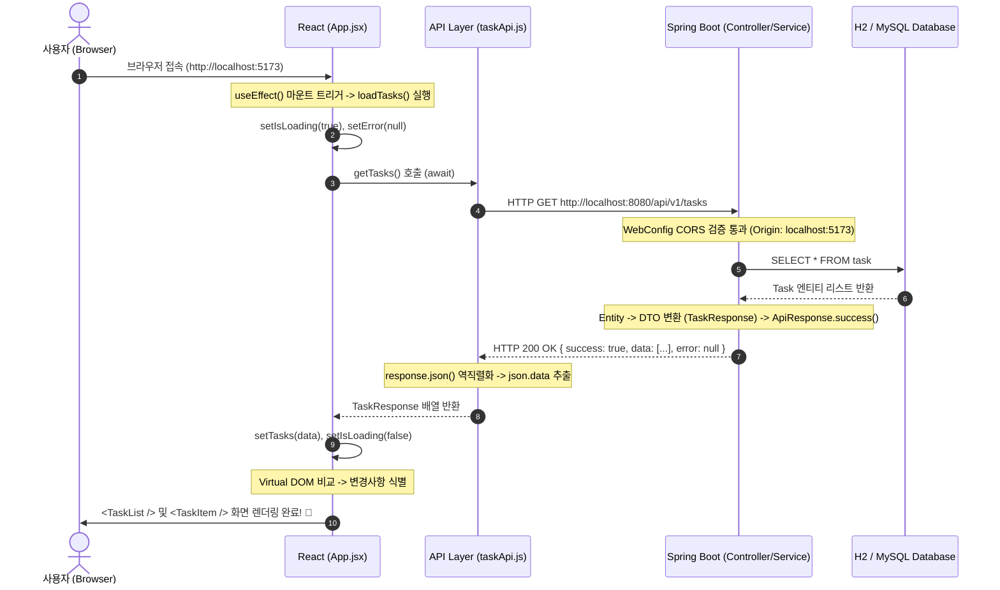
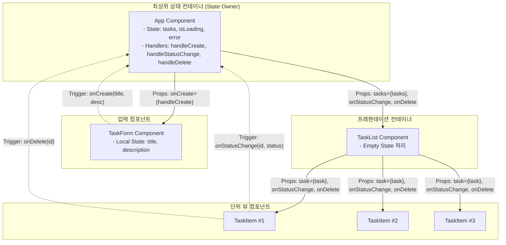

# Chapter 02. 엔터프라이즈 API 규격 설계와 모던 리액트 아키텍처

> **"백엔드가 보낸 데이터를 화면에 그리는 것은 단순한 통신이 아니다. 서버와 클라이언트가 맺은 엄격한 약속(API Contract)을 안전하게 실행하고, 컴포넌트의 단방향 데이터 흐름을 통해 예측 가능한 UI를 완성하는 엔지니어링이다."**

---

## 1. Chapter 제목 및 학습 목표

### 🎯 단원 핵심 목표
1. **엔터프라이즈 API Contract 구축**: 프론트엔드와 백엔드가 합의한 표준 응답 포맷(`ApiResponse<T>`)을 바탕으로 클라이언트 통신 계층을 캡슐화한다.
2. **웹 보안 및 브라우저 정책 이해**: 동일 출처 정책(SOP)과 교차 출처 리소스 공유(CORS)의 동작 원리를 이해하고 브라우저의 사전 요청(Preflight)을 파악한다.
3. **자바스크립트 비동기 논블로킹 엔진 습득**: 싱글 스레드 환경에서 브라우저 멈춤(Freezing) 없이 동작하는 `Promise`, `async/await` 메커니즘을 마스터한다.
4. **리액트 렌더링 멘탈 모델 정립**: 불변성(Immutability), 얕은 비교(Shallow Compare), 가상 DOM(Virtual DOM)의 동작 원리를 이해한다.
5. **실무형 컴포넌트 모듈화**: 관심사 분리(SoC) 원칙에 따라 최상위 컨테이너와 하위 프레젠테이션 컴포넌트로 분리하고, 단방향 Props 흐름과 상태 끌어올리기(Lifting State Up)를 구현한다.
6. **비동기 3대 상태(Loading, Error, Success) 격리**: 실무 엔터프라이즈 수준의 완벽한 예외 처리와 로딩 UX를 제공한다.

---

## 2. 아키텍처 배경 및 이론 (Background & Core Principles)

### 2.1 엔터프라이즈 API Contract와 공통 응답 규격 (ApiResponse)
실무에서 프론트엔드와 백엔드가 협업할 때 가장 빈번하게 발생하는 재앙은 **"응답 규격의 파편화"**입니다.
어떤 API는 성공 시 `{ id: 1, title: '...' }`을 그냥 던지고, 어떤 API는 `{ result: 'OK', payload: [...] }`을 반환하며, 실패 시에는 문자열 하나만 덜렁 보내거나 500 HTML 에러 페이지를 뿜어내는 구조는 프론트엔드 코드 전반에 수많은 `if/else` 예외 코드를 번식시킵니다.

엔터프라이즈 아키텍처에서는 이를 방지하기 위해 **모든 HTTP 응답을 단 하나의 공통 Envelope(봉투)로 래핑**합니다:

```json
{
  "success": true,
  "data": [ ... 실제 비즈니스 DTO 페이로드 ... ],
  "error": null
}
```

에러 발생 시에도 HTTP Status Code와 더불어 일관된 에러 페이로드를 전달합니다:

```json
{
  "success": false,
  "data": null,
  "error": {
    "code": "TASK_NOT_FOUND",
    "message": "해당 ID의 태스크를 찾을 수 없습니다."
  }
}
```

프론트엔드 API 계층(`taskApi.js`)은 이 규격을 완벽하게 이해하고 통신 오류 및 백엔드 비즈니스 실패(`!json.success`)를 가로채어 자바스크립트 `Error` 객체로 변환하는 방어막 역할을 수행합니다.

---

### 2.2 웹 보안의 기초: SOP(Same-Origin Policy)와 CORS
* **SOP (Same-Origin Policy, 동일 출처 정책)**: 브라우저가 사용자를 보호하기 위해 만든 가장 기본적인 보안 원칙입니다. **프로토콜(http/https)**, **호스트(도메인/IP)**, **포트(Port)** 중 하나라도 다르면 다른 출처(Cross-Origin)로 간주하고 스크립트에 의한 리소스 접근을 기본적으로 차단합니다.
  * 프론트엔드: `http://localhost:5173`
  * 백엔드: `http://localhost:8080`
  * 두 주소는 포트 번호가 다르므로 브라우저는 엄연히 다른 출처로 판정합니다.
* **CORS (Cross-Origin Resource Sharing)**: 브라우저가 다른 출처의 리소스를 안전하게 요청할 수 있도록 백엔드가 HTTP 응답 헤더를 통해 허가해주는 메커니즘입니다.
  * 백엔드의 Spring Boot `WebConfig`에서 `Access-Control-Allow-Origin: http://localhost:5173` 헤더를 실어 보내주어야만 브라우저가 응답 데이터를 자바스크립트 엔진에 넘겨줍니다.

---

### 2.3 자바스크립트 비동기 메커니즘 (싱글 스레드와 진동벨 모델)
자바(Spring Boot)는 멀티 스레드 기반이므로 클라이언트의 요청마다 전담 스레드를 배정하여 DB 조회가 끝날 때까지 동기(Synchronous) 방식으로 블로킹 대기할 수 있습니다.
그러나 **웹 브라우저의 자바스크립트 런타임은 싱글 스레드(Single-Thread)**로 동작합니다. 즉, 일하는 직원이 단 한 명뿐입니다.

만약 브라우저 직원이 백엔드 API를 호출하고 응답이 올 때까지(0.5초) 자리를 지키며 기다린다면, 그 0.5초 동안 사용자의 마우스 클릭, 휠 스크롤, 화면 애니메이션 등 모든 브라우저 이벤트 처리가 멈추는 **프리징(Freezing, 렌더링 락)** 현상이 일어납니다.

* **`async` 키워드**: "이 함수는 내부적으로 시간이 오래 걸리는 외부 작업(I/O, 네트워크)을 포함하고 있으며, 완료 시 결과를 담은 Promise를 반환한다"고 선언합니다.
* **`await` 키워드**: 브라우저 전체를 멈추지 않고, **카페 진동벨**처럼 백엔드 응답이 도착할 때까지 해당 비동기 실행 컨텍스트만 일시 중지한 뒤, 응답이 도착하면 결과를 변수에 할당하고 다음 줄을 실행합니다.

---

### 2.4 리액트 렌더링 엔진과 불변성(Immutability)의 법칙
리액트는 **상태(State)가 변경될 때마다 컴포넌트를 다시 실행하여 새로운 Virtual DOM을 생성하고, 이전 Virtual DOM과의 차이점(Diffing)만을 실제 브라우저 DOM에 반영**합니다.

이때 리액트는 성능 최적화를 위해 **얕은 비교(Shallow Comparison, 참조값 비교)**를 사용합니다:
* 객체나 배열 내부의 속성값 하나하나를 깊은 탐색(Deep Compare)으로 비교하면 데이터가 커질수록 엄청난 연산 비용이 발생합니다.
* 따라서 리액트는 객체의 **메모리 주소(Reference)**가 달라졌는지만 검사합니다.
* **불변성을 지키지 않은 경우**: `tasks.push(newTask)` 처럼 기존 배열을 직접 수정하면, 배열 안의 내용은 바뀌었지만 배열의 메모리 주소값은 그대로이므로 리액트는 "아무것도 바뀌지 않았네?" 하고 화면을 다시 그리지 않습니다.
* **불변성을 지킨 경우**: `setTasks([...tasks, newTask])` 처럼 전개 연산자(`...`)를 사용하여 완전히 새로운 배열 인스턴스를 생성해 할당해야 리액트가 메모리 주소의 변화를 감지하고 화면을 다시 그립니다.

---

### 2.5 단방향 데이터 흐름(Unidirectional Data Flow)과 컴포넌트 계층 분리
리액트 아키텍처의 황금률은 **"데이터는 위에서 아래로(Props Down), 이벤트는 아래에서 위로(Events Up)"** 흐른다는 점입니다.

1. **상태 끌어올리기 (Lifting State Up)**: 여러 자식 컴포넌트가 공통으로 필요로 하는 데이터(`tasks`, `isLoading`, `error`)는 그들을 아우르는 공통 부모(`App`)가 소유하고 관리합니다.
2. **단방향 Props 전달**: 부모 컴포넌트는 하위 컴포넌트(`TaskList`, `TaskItem`)에게 읽기 전용 데이터(Props)로 상태를 내려줍니다.
3. **이벤트 핸들러 콜백 주입**: 하위 컴포넌트는 상태를 직접 수정할 권한이 없으므로, 부모가 내려준 함수(`onStatusChange`, `onDelete`, `onCreate`)를 호출함으로써 부모에게 상태 변경을 요청(Trigger)합니다.

---

### 2.6 실무 비동기 UI 원칙: 3대 상태(Loading, Error, Success) 격리
실무 엔터프라이즈 환경에서 네트워크는 언제나 불안정하며 실패할 수 있습니다. 데이터를 화면에 바인딩할 때 다음 3대 상태를 명확히 분리하여 렌더링해야 합니다:

1. **로딩 상태 (`isLoading === true`)**: 서버 통신이 진행되는 동안 스피너나 스켈레톤 UI를 제공하여 사용자가 버튼을 중복 클릭하지 않도록 보호합니다.
2. **에러 상태 (`error !== null`)**: 서버가 죽었거나 500 에러가 발생했을 때 백지 화면 대신 명확한 에러 원인과 재시도 안내 문구를 표시합니다.
3. **성공 상태 (`!isLoading && !error`)**: 정상적으로 파싱된 데이터를 테이블이나 카드 형태로 안전하게 렌더링합니다. (데이터가 0건일 때의 Empty State 처리 포함)

---

## 3. 심층 다이어그램 및 시각화 (Deep Dive Diagrams)

### 3.1 End-to-End 전체 데이터 대항해 7단계 파이프라인



---

### 3.2 리액트 컴포넌트 계층 트리와 데이터/이벤트 흐름



---

### 3.3 메모리 참조 모델: 리액트 불변성(Immutability) 감지 원리

```
[직접 수정 시 - 리렌더링 실패 ❌]
변수 tasks ───► [ 주소 0x1000 : [ TaskA, TaskB ] ]
               tasks.push(TaskC) 실행!
변수 tasks ───► [ 주소 0x1000 : [ TaskA, TaskB, TaskC ] ]
리액트 판정: "이전 주소(0x1000) === 현재 주소(0x1000) 이므로 변경 없음! 화면 안 그림!"

[불변성 준수 시 - 리렌더링 성공 ✅]
변수 tasks ───► [ 주소 0x1000 : [ TaskA, TaskB ] ]
               setTasks([...tasks, TaskC]) 실행!
변수 tasks ───► [ 주소 0x2000 : [ TaskA, TaskB, TaskC ] ] (새로운 메모리 할당!)
리액트 판정: "이전 주소(0x1000) !== 현재 주소(0x2000) 발견! Virtual DOM 리렌더링 시작!"
```

---

## 4. 단계별 실전 코드 구현 (Step-by-Step Implementation)

### 4.1 API 통신 계층 (`frontend/src/api/taskApi.js`)
모든 HTTP 통신 로직을 UI 컴포넌트로부터 완전히 격리하여 재사용성과 유지보수성을 극대화합니다.

```javascript
// 백엔드 엔드포인트 기본 URL
const BASE_URL = 'http://localhost:8080/api/v1/tasks';

// 1. 전체 태스크 목록 조회 (GET)
export async function getTasks() {
    // 1-1. 비동기 HTTP GET 요청 발송 (브라우저 스레드 블로킹 없음)
    const response = await fetch(BASE_URL);
    
    // 1-2. HTTP 상태 코드가 200번대가 아닐 경우 에러 투척
    if (!response.ok) {
        throw new Error(`HTTP 에러 발생: ${response.status}`);
    }
    
    // 1-3. 백엔드의 공통 응답 규격 ApiResponse { success, data, error } 파싱
    const json = await response.json();
    
    // 1-4. 순수 비즈니스 데이터(List<TaskResponse>) 페이로드만 반환
    return json.data;
}

// 2. 신규 태스크 생성 (POST)
export async function createTask(title, description) {
    const response = await fetch(BASE_URL, {
        method: 'POST',
        headers: { 'Content-Type': 'application/json' },
        body: JSON.stringify({ title, description }) // 자바스크립트 객체를 JSON 문자열로 직렬화
    });

    const json = await response.json();

    // 2-1. 백엔드 @Valid 유효성 검증 실패(400) 또는 비즈니스 로직 에러 방어
    if (!response.ok || !json.success) {
        throw new Error(json.error ? json.error.message : '태스크 생성 실패');
    }
    return json.data;
}

// 3. 태스크 상태 변경 (PATCH)
export async function updateTaskStatus(id, status) {
    const response = await fetch(`${BASE_URL}/${id}/status`, {
        method: 'PATCH',
        headers: { 'Content-Type': 'application/json' },
        body: JSON.stringify({ status })
    });

    const json = await response.json();
    if (!response.ok || !json.success) {
        throw new Error(json.error ? json.error.message : '상태 변경 실패');
    }
    return json.data;
}

// 4. 태스크 삭제 (DELETE)
export async function deleteTask(id) {
    const response = await fetch(`${BASE_URL}/${id}`, {
        method: 'DELETE'
    });

    if (!response.ok) {
        throw new Error('태스크 삭제 실패');
    }
    // 4-1. 백엔드에서 204 No Content가 오므로 본문 파싱 없이 true 반환
    return true;
}
```

---

### 4.2 최상위 상태 관리자 (`frontend/src/App.jsx`)
애플리케이션의 핵심 비즈니스 상태를 독점 관리하고 하위 컴포넌트를 조율합니다.

```jsx
import { useEffect, useState } from 'react';
import { getTasks, createTask, updateTaskStatus, deleteTask } from './api/taskApi';
import './App.css';
import TaskForm from './components/TaskForm';
import TaskList from './components/TaskList';

function App() {
  // 1. 비동기 3대 상태 격리 선언
  const [tasks, setTasks] = useState([]);           // 1-1. 데이터 (Success 상태)
  const [isLoading, setIsLoading] = useState(true); // 1-2. 로딩 중 (Loading 상태)
  const [error, setError] = useState(null);        // 1-3. 에러 메시지 (Error 상태)

  // 2. 태스크 목록 원격 동기화 함수
  const loadTasks = async () => {
    setIsLoading(true);
    setError(null);
    try {
      const data = await getTasks(); // 비동기 API 통신 대기
      setTasks(data);                // 새로운 배열 참조로 상태 갱신 -> 리렌더링 유발
    } catch (err) {
      setError(err.message);
    } finally {
      setIsLoading(false);           // 성공/실패 여부와 무관하게 로딩 종료
    }
  };

  // 3. 컴포넌트 첫 마운트 시 단 1회 실행되는 라이프사이클 훅
  useEffect(() => {
    loadTasks();
  }, []); // 의존성 배열 []이 비어있으므로 마운트 시점에만 실행

  // 4. 신규 등록 핸들러 (TaskForm으로부터 제목과 설명을 전달받음)
  const handleCreate = async (title, description) => {
    try {
      await createTask(title, description);
      loadTasks(); // 서버 데이터와 클라이언트 상태 재동기화
    } catch (err) {
      alert(`[생성 실패] ${err.message}`);
    }
  };

  // 5. 상태 변경 핸들러 (TODO -> IN_PROGRESS -> DONE)
  const handleStatusChange = async (id, nextStatus) => {
    try {
      await updateTaskStatus(id, nextStatus);
      loadTasks();
    } catch (err) {
      alert(`[상태 변경 실패] ${err.message}`);
    }
  };

  // 6. 삭제 핸들러
  const handleDelete = async (id) => {
    if (!window.confirm('정말 삭제하시겠습니까?')) return;
    try {
      await deleteTask(id);
      loadTasks();
    } catch (err) {
      alert(`[삭제 실패] ${err.message}`);
    }
  };

  return (
    <div style={{ maxWidth: '850px', margin: '40px auto', fontFamily: 'system-ui, sans-serif', padding: '20px' }}>
      <h1>🚀 엔터프라이즈 태스크 매니저</h1>

      {/* 입력 컴포넌트 (생성 함수 콜백 주입) */}
      <TaskForm onCreate={handleCreate} />

      {/* 상태 1: 로딩 중 렌더링 */}
      {isLoading && (
        <div style={{ textAlign: 'center', padding: '30px', color: '#64748b' }}>
          ⏳ 서버에서 태스크 목록을 불러오는 중입니다...
        </div>
      )}

      {/* 상태 2: 에러 발생 렌더링 */}
      {error && (
        <div style={{ background: '#fee2e2', color: '#dc2626', padding: '15px', borderRadius: '6px', marginBottom: '20px' }}>
          ⚠️ 서버 통신 에러: {error}
        </div>
      )}

      {/* 상태 3: 정상 데이터 테이블 렌더링 */}
      {!isLoading && !error && (
        <TaskList
          tasks={tasks}
          onStatusChange={handleStatusChange}
          onDelete={handleDelete}
        />
      )}
    </div>
  );
}

export default App;
```

---

### 4.3 폼 입력 캡슐화 컴포넌트 (`frontend/src/components/TaskForm.jsx`)
입력창의 상태(`title`, `description`)를 내부에 완전 캡슐화하여 부모 컴포넌트의 불필요한 리렌더링을 방지합니다.

```jsx
import { useState } from "react";

function TaskForm({ onCreate }) {
    // 1. 입력 필드를 통제하는 로컬 상태 (Controlled Component)
    const [title, setTitle] = useState('');
    const [description, setDescription] = useState('');

    // 2. 폼 제출 이벤트 처리
    const handleSubmit = (e) => {
        e.preventDefault(); // 브라우저의 기본 페이지 새로고침 동작 차단
        
        // 2-1. 클라이언트 1차 유효성 검증
        if (!title.trim()) {
            alert('태스크 제목을 입력해주세요!');
            return;
        }

        // 2-2. 부모(App)가 주입해준 콜백 함수를 호출하여 데이터 상향 전달 (Event Up)
        onCreate(title, description);

        // 2-3. 제출 성공 후 입력 폼 초기화
        setTitle('');
        setDescription('');
    };

    return (
        <form onSubmit={handleSubmit} style={{ display: 'flex', gap: '10px', marginBottom: '30px' }}>
            <input
                type="text"
                placeholder="태스크 제목 (필수)"
                value={title}
                onChange={(e) => setTitle(e.target.value)} // 리액트가 입력값을 100% 제어
                style={{ flex: 2, padding: '10px', border: '1px solid #ccc', borderRadius: '4px' }}
            />
            <input
                type="text"
                placeholder="상세 설명"
                value={description}
                onChange={(e) => setDescription(e.target.value)}
                style={{ flex: 3, padding: '10px', border: '1px solid #ccc', borderRadius: '4px' }}
            />
            <button
                type="submit"
                style={{
                    padding: '10px 20px', cursor: 'pointer', background: '#2563eb',
                    color: 'white', border: 'none', borderRadius: '4px', fontWeight: 'bold'
                }}
            >
                등록
            </button>
        </form>
    );
}

export default TaskForm;
```

---

### 4.4 데이터 목록 테이블 컨테이너 (`frontend/src/components/TaskList.jsx`)
데이터 배열을 순회하며 빈 화면 UX(Empty State)를 방어하고 각 아이템 컴포넌트로 분기합니다.

```jsx
import TaskItem from "./TaskItem";

// 부모로부터 읽기 전용 Props를 전달받음
function TaskList({ tasks, onStatusChange, onDelete }) {
    // 실무 팁: 데이터가 0개일 때 사용자 이탈을 방지하는 Empty State UX!
    if (tasks.length === 0) {
        return (
            <div style={{ textAlign: 'center', padding: '40px', color: '#94a3b8', background: '#f8fafc', borderRadius: '8px' }}>
                🎉 등록된 태스크가 없습니다! 새로운 태스크를 등록해보세요.
            </div>
        );
    }

    return (
        <table style={{ width: '100%', borderCollapse: 'collapse', textAlign: 'left', background: 'white', boxShadow: '0 1px 3px rgba(0,0,0,0.1)' }}>
            <thead>
                <tr style={{ borderBottom: '2px solid #e2e8f0', background: '#f8fafc' }}>
                    <th style={{ padding: '12px' }}>ID</th>
                    <th style={{ padding: '12px' }}>제목</th>
                    <th style={{ padding: '12px' }}>설명</th>
                    <th style={{ padding: '12px' }}>상태</th>
                    <th style={{ padding: '12px' }}>생성일시</th>
                    <th style={{ padding: '12px' }}>관리</th>
                </tr>
            </thead>
            <tbody>
                {/* 
                  고유 식별자 key={task.id}를 반드시 부여해야 리액트 Virtual DOM이 
                  어떤 행이 추가/수정/삭제되었는지 O(1)의 속도로 추적할 수 있음
                */}
                {tasks.map((task) => (
                    <TaskItem
                        key={task.id}
                        task={task}
                        onStatusChange={onStatusChange}
                        onDelete={onDelete}
                    />
                ))}
            </tbody>
        </table>
    );
}

export default TaskList;
```

---

### 4.5 단위 레코드 뷰 및 인라인 액션 (`frontend/src/components/TaskItem.jsx`)
단일 태스크의 상태별 뱃지 스타일링 및 상태 전이(State Transition) 버튼을 렌더링합니다.

```jsx
function TaskItem({ task, onStatusChange, onDelete }) {
    return (
        <tr style={{ borderBottom: '1px solid #f1f5f9' }}>
            <td style={{ padding: '12px' }}>{task.id}</td>
            <td style={{ padding: '12px', fontWeight: 'bold' }}>{task.title}</td>
            <td style={{ padding: '12px', color: '#475569' }}>{task.description}</td>
            <td style={{ padding: '12px' }}>
                {/* 상태별 동적 배지 스타일링 (TODO, IN_PROGRESS, DONE) */}
                <span style={{
                    padding: '4px 8px', borderRadius: '4px', fontSize: '12px', fontWeight: 'bold',
                    background: task.status === 'DONE' ? '#dcfce7' :
                        task.status === 'IN_PROGRESS' ? '#fef9c3' : '#f1f5f9',
                    color: task.status === 'DONE' ? '#15803d' :
                        task.status === 'IN_PROGRESS' ? '#a16207' : '#475569'
                }}>
                    {task.status}
                </span>
            </td>
            <td style={{ padding: '12px', fontSize: '13px', color: '#64748b' }}>
                {task.createdAt ? new Date(task.createdAt).toLocaleDateString() : '-'}
            </td>
            <td style={{ padding: '12px', display: 'flex', gap: '6px' }}>
                {/* DONE 상태가 아닐 때만 다음 단계로 전이하는 액션 버튼 노출 */}
                {task.status !== 'DONE' && (
                    <button
                        onClick={() => onStatusChange(task.id, task.status === 'TODO' ? 'IN_PROGRESS' : 'DONE')}
                        style={{ padding: '6px 10px', cursor: 'pointer', fontSize: '12px', borderRadius: '4px', border: '1px solid #cbd5e1', background: '#fff' }}
                    >
                        {task.status === 'TODO' ? '진행하기' : '완료하기'}
                    </button>
                )}
                {/* 삭제 버튼 */}
                <button
                    onClick={() => onDelete(task.id)}
                    style={{ padding: '6px 10px', cursor: 'pointer', fontSize: '12px', background: '#ef4444', color: 'white', border: 'none', borderRadius: '4px' }}
                >
                    삭제
                </button>
            </td>
        </tr>
    );
}

export default TaskItem;
```

---

## 5. 실무 트러블슈팅 및 함정 (Troubleshooting & Pitfalls)

### 5.1 브라우저 완전 백지(White Screen)와 ReferenceError
* **현상**: 브라우저 화면에 아무것도 나타나지 않고 흰색 화면만 지속됨. 브라우저 F12 콘솔에 `Uncaught ReferenceError: onStatusChange is not defined` 발생.
* **원인**:
  * 부모 컴포넌트(`App.jsx`)는 `<TaskList onStatusChange={handleStatusChange} />` 로 Props를 전달함.
  * 그러나 자식 컴포넌트(`TaskList.jsx`)의 매개변수 구조분해 할당에서 `function TaskList({ tasks, onStatus, onDelete })` 처럼 이름을 `onStatus`로 잘못 선언함.
  * 렌더링 과정에서 자식 컴포넌트 내부의 `onStatusChange={onStatusChange}` 표현식을 평가할 때 해당 변수를 스코프에서 찾지 못해 예외 발생.
  * **리액트는 렌더링 중 잡히지 않은(Unhandled) 자바스크립트 런타임 에러가 발생하면 비정상적 UI 오염을 막기 위해 전체 컴포넌트 트리를 DOM에서 언마운트(Unmount)함.**
* **해결책**:
  * Props를 넘겨주는 부모의 속성명과 자식의 구조분해 할당 매개변수명을 100% 동일하게 일치시킴.
  * 실무에서는 TypeScript 인터페이스 도입 또는 ESLint의 `react/prop-types` 규칙을 활성화하여 컴파일 타임에 즉시 탐지함.

---

### 5.2 컴포넌트 분리 후 폼 제출 시 이벤트 객체 불일치 및 Dead State
* **현상**: 등록 버튼 클릭 시 아무 반응이 없거나 `TypeError: e.preventDefault is not a function` 발생.
* **원인**:
  * 컴포넌트를 분리하기 전에는 `handleCreate(e)`가 폼의 submit 이벤트 객체 `e`를 직접 받았음.
  * 모듈화 후 `TaskForm.jsx` 내부에서 이미 `e.preventDefault()`를 수행하고 부모에게는 순수 데이터 문자열인 `onCreate(title, description)`을 올려보냄.
  * 부모(`App.jsx`)가 여전히 첫 번째 매개변수를 `e`로 착각하고 `e.preventDefault()`를 호출하면, 문자열 객체에는 `preventDefault` 메서드가 없으므로 타입 에러가 발생함.
  * 동시에 `App.jsx`에 방치된 `const [title, setTitle] = useState('')`는 더 이상 입력창과 바인딩되지 않는 **Dead State**가 되어 빈 문자열만 서버로 전송됨.
* **해결책**:
  * 컴포넌트 분리 시 상태의 소유권을 명확히 재정의함. 폼 입력값의 소유권이 `TaskForm`으로 넘어갔다면, 부모는 순수 데이터 인자만 수신하도록 함수 시그니처를 변경하고 불필요한 상위 상태를 즉시 제거함.

---

### 5.3 useEffect 의존성 배열 누락으로 인한 무한 렌더링 루프 (Infinite Render Loop)
* **현상**: 화면이 버벅거리며 브라우저 팬이 강하게 돌고 백엔드 콘솔에 수천 건의 SELECT 쿼리가 쏟아짐.
* **원인**:
  ```jsx
  // ❌ 무한 루프 폭탄 코드
  useEffect(() => {
    loadTasks(); // 1. 서버에서 데이터 가져와서 setTasks() 실행
  }); // 2. 의존성 배열 []이 누락됨!
  ```
  * 의존성 배열이 없으면 컴포넌트가 렌더링될 때마다 `useEffect`가 재실행됨.
  * `loadTasks()` 실행 ➔ `setTasks()`로 상태 변경 ➔ 리액트 리렌더링 트리거 ➔ `useEffect` 재실행 ➔ `loadTasks()` 실행... 무한 반복!
* **해결책**:
  * 컴포넌트 마운트 시 단 1회만 초기화해야 하는 네트워크 조회는 반드시 **빈 배열 `[]`**을 명시함.

---

### 5.4 JSX 인라인 스타일 오타와 브라우저 렌더링 무시
* **현상**: 버튼이나 태그에 배경색, 여백이 적용되지 않고 기본 못생긴 스타일로 렌더링됨.
* **원인**:
  * `styld={{ padding: '12px' }}` : HTML/JSX 표준 속성은 `style`임. 잘못된 속성명은 무시됨.
  * `backgournd: '#ef4444'` : CSS 속성명 오타.
  * `border: '1px solid #cb5e1'` : 16진수 색상 코드는 3자리, 6자리, 8자리여야 함. 5자리는 유효하지 않은 CSS 값이므로 무시됨.
* **해결책**:
  * 정확한 카멜 케이스(camelCase) CSS 속성명(`backgroundColor`, `style`) 및 유효한 6자리 HEX 코드(`#cbd5e1`) 준수.

---

## 6. 단원 마무리 퀴즈 및 점검 과제 (Wrap-up Quiz & Challenges)

### 🧠 점검 퀴즈 (Quiz)

#### Q1. 다음 중 리액트의 상태 변경과 렌더링에 대한 설명으로 가장 올바른 것은?
1. 리액트는 배열의 요소가 변경되었는지 확인하기 위해 배열 내부의 모든 원소를 깊은 비교(Deep Comparison)한다.
2. `tasks.push(newTask)`를 호출한 뒤 `setTasks(tasks)`를 실행하면 참조 주소가 동일하므로 리액트는 리렌더링을 생략한다.
3. 리액트의 싱글 스레드 블로킹을 방지하기 위해 모든 상태 변경 함수는 자동으로 멀티 스레드 풀에서 실행된다.
4. `useState`의 반환값 중 첫 번째 요소는 상태를 변경하는 함수이고 두 번째 요소는 현재 상태 값이다.

> **정답 및 해설**: **2번**  
> 리액트는 성능을 위해 얕은 비교(참조 주소 비교)를 수행합니다. `tasks.push()`는 기존 배열 객체의 내부만 변경할 뿐 메모리 주소를 바꾸지 않으므로, `setTasks(tasks)`를 넘기면 이전 주소와 동일하다고 판단하여 가상 DOM 비교 및 리렌더링을 트리거하지 않습니다. 따라서 반드시 전개 연산자(`[...tasks, newTask]`)를 사용하여 새로운 메모리 주소를 가진 복사본을 전달해야 합니다.

---

#### Q2. 프론트엔드(`localhost:5173`)에서 백엔드(`localhost:8080`)로 데이터를 요청할 때 발생하는 브라우저 정책과 관련된 설명으로 틀린 것은?
1. 동일 출처 정책(SOP)에 따르면 두 URL은 포트 번호가 다르므로 서로 다른 출처(Cross-Origin)로 취급된다.
2. 백엔드에서 CORS 설정(`@CrossOrigin` 또는 `WebMvcConfigurer`)을 해주지 않으면, 브라우저는 백엔드의 응답을 차단하고 스크립트에 에러를 던진다.
3. CORS 에러는 백엔드 서버 프로세스가 죽어서 HTTP 요청 자체를 수신하지 못했을 때 발생하는 네트워크 단절 현상이다.
4. 브라우저는 실제 요청을 보내기 전 안전성 검증을 위해 OPTIONS 메서드를 사용한 Preflight 요청을 백엔드에 먼저 전송할 수 있다.

> **정답 및 해설**: **3번**  
> CORS 에러는 백엔드가 죽어서 발생하는 것이 아닙니다. 백엔드는 실제로 요청을 정상 수신하고 200 OK 응답을 브라우저에 반환했을 수 있습니다. 그러나 응답 헤더에 `Access-Control-Allow-Origin`이 누락되어 있거나 출처가 불일치할 경우, **브라우저가 보안 정책에 의해 해당 응답 데이터를 프론트엔드 자바스크립트 코드에 전달하지 않고 가로막아 차단**하는 것입니다.

---

#### Q3. 자바스크립트 비동기 문법 `async / await`에 대한 설명 중 틀린 것은?
1. `async`가 붙은 함수는 명시적으로 반환값을 지정하지 않아도 항상 `Promise` 객체를 반환한다.
2. `await` 키워드는 자바스크립트 엔진의 메인 스레드를 멈추어 다른 브라우저 이벤트 처리를 차단(Blocking)한다.
3. `await`는 반드시 `async` 함수 내부에서만 사용될 수 있다 (최상위 탑레벨 await 제외).
4. `await getTasks()`에서 백엔드 통신 에러가 발생하면 `try / catch` 블록을 통해 동기식 코드처럼 직관적으로 에러를 포착할 수 있다.

> **정답 및 해설**: **2번**  
> `await`는 자바스크립트 메인 스레드를 멈추는(Blocking) 것이 아닙니다. 해당 비동기 함수의 실행 컨텍스트만 일시 정지(Pause)해두고 메인 스레드는 즉시 이벤트 루프로 복귀하여 사용자의 클릭, 스크롤, 화면 렌더링 등 다른 작업을 논블로킹(Non-Blocking)으로 처리합니다.

---

### 🚀 실전 심화 과제 (Self-Challenge)
1. **Empty State 인터랙션 확장**:
   * 태스크 목록이 0개일 때 보여주는 빈 화면(`TaskList.jsx`)에 "첫 번째 태스크 등록하기" 버튼을 추가하고, 클릭 시 상단 `TaskForm`의 첫 번째 입력창(제목)으로 포커스(Focus)가 자동 이동하도록 `useRef` 훅을 연동해보세요.
2. **비동기 통신 실패 시 재시도(Retry) UX 구현**:
   * 백엔드 서버가 일시적으로 꺼져서 `error` 상태가 렌더링되었을 때, 에러 박스 안에 **[다시 시도]** 버튼을 만들고 클릭 시 `loadTasks()`를 재호출하도록 구현해보세요.
