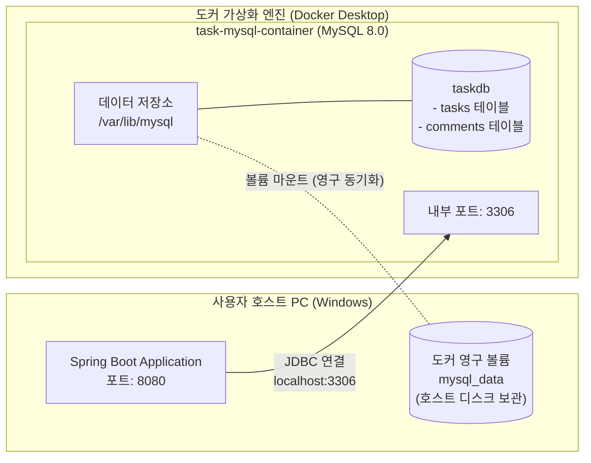
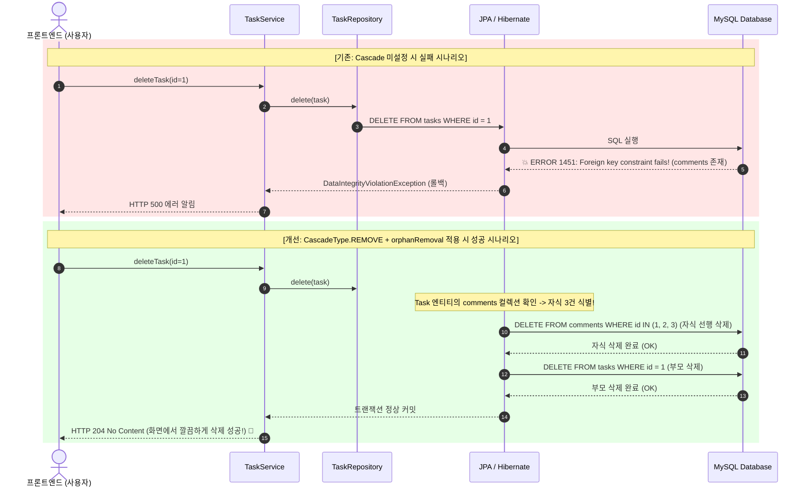

# Chapter 03. Docker 인프라 구축과 MySQL 데이터 영속성 아키텍처

> **"소프트웨어는 메모리 위에서 숨 쉬지만, 데이터는 영속성(Persistence)을 통해 생명을 얻는다. 컨테이너 가상화를 통해 멱등성 있는 인프라를 구축하고, RDBMS의 무결성 제약조건과 JPA 영속성 전이를 올바르게 다루는 것이 엔터프라이즈 풀스택의 진정한 시작이다."**

---

## 1. Chapter 제목 및 학습 목표

### 🎯 단원 핵심 목표
1. **컨테이너 가상화와 코드형 인프라(IaC) 정립**: 가상머신(VM)과 도커(Docker) 컨테이너의 아키텍처 차이를 이해하고, `docker-compose.yml`을 통해 격리된 MySQL 8.0 데이터베이스 서버를 선언적으로 구축한다.
2. **도커 데이터 볼륨(Volume)을 통한 영속성 확보**: 컨테이너의 소멸성(Ephemeral) 한계를 극복하고, 호스트 파일시스템 바인딩을 통해 데이터가 영구 보존되는 메커니즘을 마스터한다.
3. **스프링 부트 데이터소스 전환과 인증 프로토콜 이해**: H2 인메모리 DB에서 MySQL 8.0 프로덕션 드라이버로 전환하고, MySQL 8.0의 RSA 비대칭 인증 플러그인(`caching_sha2_password`)과 `allowPublicKeyRetrieval`의 동작 원리를 파악한다.
4. **RDBMS 외래 키(Foreign Key) 참조 무결성 제약조건 체득**: 부모 테이블과 자식 테이블 간의 무결성 법칙(`Cannot delete or update a parent row`)을 이해한다.
5. **JPA 영속성 전이(Cascade) 및 고아 객체 제거(orphanRemoval)**: 부모 엔티티의 생명주기 변화가 자식 엔티티로 안전하게 전파되는 객체지향적 삭제 라이프사이클을 완성한다.
6. **서버 기동 시 데이터 멱등성(Idempotency) 보장**: `CommandLineRunner` 데이터 시딩 시 중복 데이터가 무한 누적되지 않도록 방어 로직을 구축한다.

---

## 2. 아키텍처 배경 및 이론 (Background & Core Principles)

### 2.1 가상머신(VM) vs 도커(Docker) 컨테이너
과거에는 로컬 컴퓨터에 MySQL 설치 파일(`msi`/`exe`)을 직접 다운로드하여 윈도우 서비스에 등록했습니다. 하지만 이는 다음과 같은 심각한 실무적 문제를 야기합니다:
* **호스트 환경 오염**: 레지스트리, 백그라운드 프로세스, 포트 점유, 버전 충돌 등으로 PC가 느려지고 찌꺼기가 남음.
* **환경 불일치("내 컴퓨터에선 되는데 서버에선 왜 안 되지?")**: 로컬 OS(Windows/macOS)와 운영 서버(Linux/Ubuntu)의 설정 차이로 인한 배포 실패.

도커(Docker)는 **게스트 OS(Guest OS)를 통째로 올리는 무거운 가상머신(VM)**과 달리, **호스트 OS의 커널(Kernel)을 공유하면서 프로세스 단위로 완벽하게 격리(Namespace & cgroups)**합니다.
* **시작 속도**: 초 단위(1~2초)
* **자원 소모**: 수십 MB 수준의 가벼운 메모리
* **코드형 인프라 (IaC)**: `docker-compose.yml` 파일 하나만 있으면 전 세계 어디서든 똑같은 환경을 3초 만에 재현할 수 있습니다.

---

### 2.2 도커 볼륨(Volume)과 데이터 영속성 (Data Persistence)
기본적으로 도커 컨테이너의 스토리지 계층(Storage Layer)은 **소멸성(Ephemeral)**입니다. 컨테이너가 중지되거나 삭제(`docker rm`)되면 그 안에서 기록된 데이터베이스 파일도 흔적 없이 함께 파괴됩니다.

RDBMS의 가장 중요한 가치는 **데이터가 절대 유실되지 않는 영속성(Persistence)**입니다.
이를 위해 도커는 **볼륨 마운트(Volume Mount)**를 사용합니다:
* 컨테이너 내부의 MySQL 데이터 저장 경로(`/var/lib/mysql`)를 호스트 컴퓨터의 안전한 전용 스토리지(`mysql_data`)로 연결(Mount)합니다.
* 따라서 컨테이너를 끄거나 삭제하더라도 실제 DB 파일은 호스트 디스크에 안전하게 남아있어, 새로운 컨테이너를 띄우면 기존 데이터가 즉시 그대로 복원됩니다.

---

### 2.3 MySQL 8.0 인증 메커니즘과 `allowPublicKeyRetrieval`
MySQL 5.7까지는 비밀번호 인증 시 단순 해시 방식(`mysql_native_password`)을 사용했습니다.
그러나 MySQL 8.0부터 보안이 대폭 강화되면서 **`caching_sha2_password`(RSA 비대칭 키 암호화)**가 기본 인증 플러그인으로 채택되었습니다.

* **동작 원리**: 클라이언트(스프링 부트)는 비밀번호를 MySQL 서버에 보낼 때 평문으로 보내지 않고, **MySQL 서버의 공개키(Public Key)**로 암호화하여 전송해야 합니다.
* **문제 발생**: 로컬 개발 환경에서 `useSSL=false`(보안 터널 미사용)로 설정할 경우, 클라이언트는 서버에게 공개키를 먼저 보내달라고 요청(`Retrieval`)해야 합니다.
* **해결책**: `allowPublicKeyRetrieval=true` 설정을 명시해야 클라이언트가 서버로부터 공개키를 전송받아 비밀번호를 안전하게 암호화할 수 있습니다. (로컬 환경에서는 루프백 통신이므로 안전하며, 실제 운영 환경에서는 SSL/TLS 암호화 터널을 사용하므로 이 옵션이 필요 없습니다.)

---

### 2.4 RDBMS 외래 키(Foreign Key) 참조 무결성 제약조건
관계형 데이터베이스(RDBMS)의 존재 이유는 **데이터 간의 무결성(Integrity)**을 보장하는 데 있습니다.

태스크(`tasks`, 부모)와 댓글(`comments`, 자식) 테이블은 `task_id` 외래 키로 결속되어 있습니다:
* 만약 자식 댓글들이 존재하는 상태에서 부모 태스크 행을 삭제(`DELETE FROM tasks WHERE id = 1`)하려고 시도하면, DB는 이를 즉각 거부하고 트랜잭션을 롤백시킵니다:
  `Error 1451: Cannot delete or update a parent row: a foreign key constraint fails`
* **이유**: 부모가 먼저 사라지면 자식 댓글들은 존재하지 않는 부모 ID를 참조하는 **고아 데이터(Orphan Data)**가 되어 데이터 정합성이 완전히 붕괴되기 때문입니다.

---

### 2.5 JPA 영속성 전이(Cascade)와 고아 객체 제거(orphanRemoval)
객체 세상에서는 부모 객체가 삭제될 때 연관된 자식 객체들도 함께 운명을 같이하는 생명주기(Lifecycle)를 갖는 경우가 흔합니다.

* **`CascadeType.REMOVE`**: 부모 엔티티에 대한 삭제 작업(`em.remove()` 또는 `repository.delete()`)이 발생할 때, 연관된 자식 엔티티들도 함께 삭제되도록 전파합니다.
* **`orphanRemoval = true`**: 부모 컬렉션에서 자식 객체가 제거되었을 때(참조가 끊어졌을 때), DB에서도 해당 자식 행을 자동으로 DELETE 쿼리를 날려 영구 제거합니다.
* **두 옵션의 결합**: 부모의 생명주기를 통해 자식의 생명주기를 100% 종속적으로 통제하는 엔터프라이즈 도메인 주도 설계(DDD)의 **Aggregate Root(애그리거트 루트)** 패턴을 완성합니다.

---

## 3. 심층 다이어그램 및 시각화 (Deep Dive Diagrams)

### 3.1 호스트 - 도커 컨테이너 간 포트 포워딩 및 볼륨 마운트 구조도



---

### 3.2 외래 키 제약조건 충돌과 Cascade 연쇄 삭제 라이프사이클



---

## 4. 단계별 실전 코드 구현 (Step-by-Step Implementation)

### 4.1 선언적 코드형 인프라 (`docker-compose.yml`)
프로젝트 루트 디렉터리에 위치하며, 데이터베이스 환경을 정의합니다.

```yaml
version: '3.8'

services:
  task-mysql:
    # 1. 도커 공식 MySQL 8.0 안정 버전 이미지 다운로드
    image: mysql:8.0
    # 2. 직관적인 컨테이너 식별 이름 지정
    container_name: task-mysql-container
    # 3. 도커 데몬이나 PC 재부팅 시 항상 컨테이너 자동 재시작
    restart: always
    # 4. MySQL 환경 변수 설정
    environment:
      MYSQL_ROOT_PASSWORD: rootpassword # 최고 관리자 비밀번호
      MYSQL_DATABASE: taskdb            # 최초 자동 생성할 데이터베이스 이름
      MYSQL_USER: taskuser              # 서비스 전용 일반 사용자 계정
      MYSQL_PASSWORD: taskpassword      # 일반 계정 비밀번호
    # 5. 포트 포워딩 (호스트 3306 포트 <-> 컨테이너 3306 포트 연결)
    ports:
      - "3306:3306"
    # 6. 볼륨 마운트 (데이터 영구 보존 핵심 설정)
    volumes:
      - mysql_data:/var/lib/mysql
    # 7. 한글(이모지 포함 utf8mb4) 및 한국 표준시(+09:00) 강제 설정
    command:
      - --character-set-server=utf8mb4
      - --collation-server=utf8mb4_unicode_ci
      - --default-time-zone=+09:00

# 호스트 레벨의 영구 볼륨 선언
volumes:
  mysql_data:
```

---

### 4.2 빌드 명세서 (`backend/build.gradle`)
MySQL 공식 JDBC 드라이버 의존성을 추가합니다.

```groovy
dependencies {
    // 1. MySQL 공식 JDBC 드라이버 추가 (자바와 MySQL 간 프로토콜 통역사)
    runtimeOnly 'com.mysql:mysql-connector-j'

    // 기존 H2 드라이버는 필요 시 테스트용으로 보존 가능
    // runtimeOnly 'com.h2database:h2'
    
    implementation 'org.springframework.boot:spring-boot-starter-data-jpa'
    implementation 'org.springframework.boot:spring-boot-starter-webmvc'
    implementation 'org.springframework.boot:spring-boot-starter-validation'
    compileOnly 'org.projectlombok:lombok'
    annotationProcessor 'org.projectlombok:lombok'
}
```

---

### 4.3 애플리케이션 프로퍼티 (`backend/src/main/resources/application.properties`)
스프링 부트가 도커 MySQL을 바라보도록 설정하고 Hibernate DDL 전략을 수립합니다.

```properties
spring.application.name=task-backend

# 1. MySQL 데이터소스 설정 (도커 3306 포트 매핑)
spring.datasource.driver-class-name=com.mysql.cj.jdbc.Driver

# ★★★ 반드시 중간 줄바꿈 없이 한 줄로 작성할 것! ★★★
spring.datasource.url=jdbc:mysql://localhost:3306/taskdb?useSSL=false&allowPublicKeyRetrieval=true&characterEncoding=UTF-8&serverTimezone=Asia/Seoul
spring.datasource.username=taskuser
spring.datasource.password=taskpassword

# 2. JPA / Hibernate 설정
# update: 기존 데이터를 보존하면서 @Entity 신규 추가/변경분만 테이블에 자동 반영 (개발용)
spring.jpa.hibernate.ddl-auto=update
spring.jpa.show-sql=true
spring.jpa.properties.hibernate.format_sql=true
spring.jpa.properties.hibernate.dialect=org.hibernate.dialect.MySQLDialect
```

---

### 4.4 연쇄 삭제 영속성 전이가 적용된 엔티티 (`Task.java`)
부모와 자식의 라이프사이클을 일치시키는 Cascade 설정을 구축합니다.

```java
package com.enterprise.taskmanager.domain.task.entity;

import com.enterprise.taskmanager.domain.comment.entity.Comment;
import com.enterprise.taskmanager.global.common.BaseTimeEntity;
import jakarta.persistence.*;
import lombok.AccessLevel;
import lombok.Getter;
import lombok.NoArgsConstructor;

import java.util.ArrayList;
import java.util.List;

@Entity
@Table(name = "tasks")
@Getter
@NoArgsConstructor(access = AccessLevel.PROTECTED)
public class Task extends BaseTimeEntity {

    @Id
    @GeneratedValue(strategy = GenerationType.IDENTITY)
    private Long id;

    @Column(nullable = false, length = 100)
    private String title;

    @Column(length = 1000)
    private String description;

    @Enumerated(EnumType.STRING)
    @Column(nullable = false)
    private TaskStatus status;

    // ★★★ 핵심 추가: 1:N 양방향 연관관계 및 연쇄 삭제 영속성 전이 ★★★
    // 1. mappedBy = "task": 연관관계의 주인인 Comment 엔티티의 'task' 필드에 위임
    // 2. cascade = CascadeType.REMOVE: Task 삭제 시 연결된 Comment들도 자동 삭제 전파
    // 3. orphanRemoval = true: 부모 컬렉션에서 분리된 고아 댓글 자동 DB 제거
    @OneToMany(mappedBy = "task", cascade = CascadeType.REMOVE, orphanRemoval = true)
    private List<Comment> comments = new ArrayList<>();

    public Task(String title, String description) {
        this.title = title;
        this.description = description;
        this.status = TaskStatus.TODO;
    }

    public void update(String title, String description) {
        if (this.status == TaskStatus.DONE) {
            throw new IllegalStateException("이미 완료된 테스크는 수정할 수 없습니다.");
        }
        this.title = title;
        this.description = description;
    }

    public void changeStatus(TaskStatus newStatus) {
        this.status = newStatus;
    }
}
```

---

### 4.5 멱등성(Idempotency) 방어가 추가된 초기화 스크립트 (`TestDataInit.java`)
서버 재기동 시 데이터가 무한 중복 누적되는 현상을 차단합니다.

```java
package com.enterprise.taskmanager.global.init;

import com.enterprise.taskmanager.domain.comment.entity.Comment;
import com.enterprise.taskmanager.domain.comment.repository.CommentRepository;
import com.enterprise.taskmanager.domain.task.entity.Task;
import com.enterprise.taskmanager.domain.task.repository.TaskRepository;
import lombok.RequiredArgsConstructor;
import org.springframework.boot.CommandLineRunner;
import org.springframework.stereotype.Component;

@Component
@RequiredArgsConstructor
public class TestDataInit implements CommandLineRunner {
    private final TaskRepository taskRepository;
    private final CommentRepository commentRepository;

    @Override
    public void run(String... args) {
        // 💡 멱등성 방어: DB에 이미 데이터가 1건이라도 존재하면 더미 생성을 즉시 건너뜁니다!
        if (taskRepository.count() > 0) {
            System.out.println("====== [기존 영구 데이터가 존재하므로 더미 데이터 생성을 건너뜁니다] ======");
            return;
        }

        System.out.println("====== [테스트 더미 데이터 자동 생성 시작] ======");
        for (int i = 1; i <= 3; i++) {
            Task task = taskRepository.save(
                    new Task("스프링 실무 마스터 태스크 " + i, "태스크 " + i + "번에 대한 상세 업무 설명입니다."));
            for (int j = 1; j <= 3; j++) {
                commentRepository.save(
                        new Comment("태스크 " + i + "에 달린 " + j + "번째 업무 댓글입니다.", "작성자_" + j, task));
            }
        }
        System.out.println("====== [테스트 더미 데이터 3개 태스크 & 9개 댓글 생성 완료] ======");
    }
}
```

---

## 5. 실무 트러블슈팅 및 함정 (Troubleshooting & Pitfalls)

### 5.1 `.properties` 파일의 개행(줄바꿈)으로 인한 URL 파라미터 무시 현상
* **현상**: `spring.datasource.url=jdbc:mysql://localhost:3306/taskdb?` 뒤에서 엔터를 쳐서 다음 줄에 옵션을 작성했더니, 한글 인코딩 깨짐이나 타임존 불일치, SSL 경고가 발생함.
* **원인**: Java Properties 파일 포맷 표준에 따르면, 개행 문자는 새로운 키-값 쌍의 시작으로 해석됩니다. 역슬래시(`\`) 없이 줄을 바꾸면 `useSSL=false...`는 완전히 무관한 독립 키로 취급되어 Spring Boot의 데이터소스 URL 파라미터에서 통째로 탈락합니다.
* **해결책**:
  * 반드시 끊김 없는 단일 라인으로 작성하거나, 줄바꿈이 필요할 경우 라인 끝에 역슬래시(`\`)를 붙여 행 연속(Line Continuation)을 선언해야 합니다.

---

### 5.2 자식 레코드가 존재하는 부모 레코드 삭제 시 외래 키 제약조건 위반 (FK Violation)
* **현상**: 새로 등록한 태스크는 정상 삭제되지만, 서버 기동 시 생성된 1~12번 태스크는 웹 화면에서 삭제를 클릭하면 아무 반응이 없거나 서버 콘솔에 `SQLIntegrityConstraintViolationException` 발생.
* **원인**:
  * `comments` 테이블이 `task_id` 외래 키로 `tasks` 테이블의 PK를 참조하고 있음.
  * 부모 레코드를 지우면 자식 레코드가 참조 대상(부모)을 잃어버리는 고아 데이터가 되므로, RDBMS 엔진이 데이터 정합성을 보호하기 위해 삭제 쿼리를 거부함.
* **해결책**:
  * 부모 엔티티(`Task`)에 `@OneToMany(mappedBy = "task", cascade = CascadeType.REMOVE, orphanRemoval = true)`를 부여하여 부모 삭제 시 자식들도 JPA 트랜잭션 내에서 안전하게 연쇄 삭제되도록 구성.

---

### 5.3 인메모리 DB에서 영구 DB 전환 시 더미 데이터 무한 누적 현상
* **현상**: H2를 쓸 때는 서버를 껐다 켜도 항상 태스크가 3개였는데, MySQL로 전환 후 서버를 재부팅할 때마다 태스크가 6개, 9개, 12개로 계속 불어남.
* **원인**:
  * H2는 프로세스 종료 시 메모리가 리셋되었으나, MySQL은 호스트 볼륨(`mysql_data`)에 데이터가 영구 보존됨.
  * `CommandLineRunner`가 서버 기동마다 무조건 `save()`를 실행하여 기존 데이터 뒤에 계속 신규 행을 INSERT함.
* **해결책**:
  * 초기화 로직 상단에 `if (taskRepository.count() > 0) return;` 방어 코드를 작성하여 멱등성(Idempotency)을 확보함.

---

## 6. 단원 마무리 퀴즈 및 점검 과제 (Wrap-up Quiz & Challenges)

### 🧠 점검 퀴즈 (Quiz)

#### Q1. 도커 컨테이너에서 데이터베이스를 운영할 때 `volumes` 설정을 반드시 적용해야 하는 가장 결정적인 이유는?
1. 볼륨을 설정하지 않으면 컨테이너 내부에서 MySQL 포트(3306)를 외부로 개방할 수 없기 때문이다.
2. 도커 컨테이너는 기본적으로 소멸성(Ephemeral)을 가지므로, 컨테이너가 삭제되면 내부 DB 파일도 유실되기 때문이다.
3. 볼륨을 마운트해야만 MySQL의 root 비밀번호를 암호화하여 저장할 수 있기 때문이다.
4. 볼륨 마운트는 오직 Windows 환경에서만 필요하며 Linux 배포 서버에서는 사용하지 않는다.

> **정답 및 해설**: **2번**  
> 컨테이너 계층의 파일 시스템은 일시적이며 컨테이너 제거 시 함께 삭제됩니다. 데이터베이스의 핵심 가치인 '영속성'을 지키기 위해서는 호스트 디스크 영역을 컨테이너 내부의 데이터 디렉토리(`/var/lib/mysql`)와 바인딩하는 볼륨 설정이 필수적입니다.

---

#### Q2. MySQL 8.0과 스프링 부트를 연결할 때 `allowPublicKeyRetrieval=true` 설정이 필요한 이유로 올바른 것은?
1. MySQL 8.0의 SSL/TLS 인증서가 만료되었을 때 강제로 무시하고 연결하기 위함이다.
2. MySQL 8.0의 기본 인증 방식인 `caching_sha2_password`에서 비SSL 연결 시 서버의 RSA 공개키를 요청하여 비밀번호를 암호화하기 위함이다.
3. 데이터베이스의 모든 사용자 계정에게 root 최고 관리자 권한을 자동으로 부여하기 위함이다.
4. JPA가 테이블 스키마 DDL을 자동으로 생성할 수 있는 권한을 얻기 위함이다.

> **정답 및 해설**: **2번**  
> MySQL 8.0은 보안 강화를 위해 비밀번호를 RSA 공개키로 암호화하여 전송하도록 강제합니다. SSL 터널을 사용하지 않는 로컬 환경(`useSSL=false`)에서는 클라이언트가 MySQL 서버로부터 공개키를 전송받을 수 있도록 허용하는 `allowPublicKeyRetrieval=true` 옵션이 필요합니다.

---

#### Q3. JPA의 `CascadeType.REMOVE`와 `orphanRemoval = true`에 대한 설명 중 틀린 것은?
1. `CascadeType.REMOVE`는 부모 엔티티를 삭제할 때 연관된 자식 엔티티들에게도 삭제 연산을 전파한다.
2. `orphanRemoval = true`는 부모 엔티티의 컬렉션에서 자식 객체를 제거(예: `comments.remove(0)`)했을 때 DB에서도 해당 자식을 자동으로 DELETE한다.
3. 두 옵션 중 하나만 적용하면 외래 키 제약조건 위반 에러를 절대 방지할 수 없다.
4. 부모와 자식의 생명주기가 완전히 일치하고 자식이 오직 하나의 부모에 의해서만 관리될 때 사용하는 것이 권장된다.

> **정답 및 해설**: **3번**  
> 부모 엔티티가 `delete()`될 때 자식을 연쇄 삭제하는 것은 `CascadeType.REMOVE`만으로도 충분히 동작합니다. `orphanRemoval = true`는 부모 객체는 살아있고 컬렉션에서 참조만 끊어졌을 때 고아 객체를 DB에서 지워주는 추가적인 기능을 제공하는 것이므로 3번은 잘못된 설명입니다.

---

### 🚀 실전 심화 과제 (Self-Challenge)
1. **도커 볼륨 영속성 스트레스 테스트**:
   * `docker compose down` 명령어로 컨테이너를 완전히 파괴하고 삭제해보세요.
   * 그 후 다시 `docker compose up -d` 로 컨테이너를 새로 띄웠을 때, 우리가 등록했던 태스크와 댓글들이 그대로 살아있는지 확인해보세요.
2. **댓글(Comment) 개수 카운트 뱃지 표시**:
   * 프론트엔드 목록 화면(`TaskItem.jsx`)의 제목 옆에 해당 태스크에 달린 댓글 수를 뱃지 형태(예: `[3]`)로 표시할 수 있도록 `TaskResponse` DTO에 `commentCount` 필드를 추가해 보세요.
